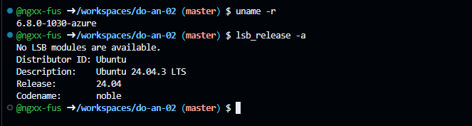

# About

Ref: [https://github.com/espressif/esp-idf](https://github.com/espressif/esp-idf)

## What is the ESP-IDF Tool?
ESP-IDF (Espressif IoT Development Framework) is the official software development kit provided by Espressif Systems for their chips (ESP32, ESP32-S3, ESP32-C3, ESP8266, etc.).

Think of it as the "native language" of the ESP32. When you use other tools (like Arduino IDE or MicroPython), they are actually running on top of ESP-IDF or using a simplified version of it underneath.

## Why use ESP-IDF instead of PlatformIO?

|Feature|ESP-IDF (Native)|PlatformIO (VS Code)|
|---|---|----|
|Difficulty|High (Steep learning curve)|Low/Medium (User-friendly)|
|Updates|Immediate (Always latest)|Delayed (Community maintained)|
|Control|100% (Every register/setting)|Limited (Depends on framework)|
|Build System|CMake (Standard in C++ world)|"SCons (Python-based\| PIO specific)"|
|Best For|"Professional Products\| Mass Production"|"Hobbyists\| Quick Prototyping"|

# Environment



# Installation

## 1. Install Prerequisites

```
sudo apt-get update
sudo apt-get install git wget flex bison gperf python3 python3-pip python3-venv cmake ninja-build ccache libffi-dev libssl-dev dfu-util libusb-1.0-0
```

## 2. Create a Directory and Clone ESP-IDF

```
mkdir -p ~/esp
cd ~/esp
git clone -b release/v6.0 --recursive https://github.com/espressif/esp-idf.git ~/esp
```

## 3. Install the Tools

```
cd ~/esp
./install.sh all
```

## 4. Setup environment before use 

```
source ~/esp/export.sh
```

## 5. Add alias into path

```
echo "alias setupESPIDF='. ~/esp/export.sh'" >> ~/.bashrc
```