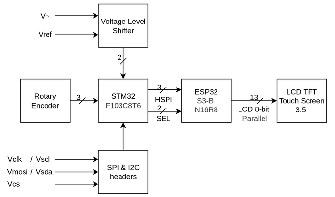

# About project

This is one of three projects (Project 01, Project 02, and the Graduation Project - Capstone Project). In this project, I will develop a device that analyzes data on SPI/I2C buses and captures analog signals for display like an oscilloscope.

# About team

My team consists of two members:
- Nguyen Thanh Phu – Student ID: 22119211 – Contact: nthanhphu.k22.hcmute@gmail.com (myself)
- Nguyen Van Quoc – Student ID: 22119222 – Contact: quocvan561@gmail.com

# About device

## General system architecture

The image below describe the blocks diagram of the device.



# Project architecture
## Project strurture
### Top-level


```
    . Current reposistory
    |
    ├── CMakeLists.txt              [01] Main CMake build configuration file
    ├── comDriver                   [02] Communication drivers (SPI, I2C, LCD, etc.)
    ├── config                      [03] System and hardware configuration files
    ├── diagram                     [04] System and hardware diagrams (.drawio)
    ├── fonts                       [05] Font data used for LCD display
    ├── helper                      [06] Utility/helper functions and tools
    ├── main                        [07] Main application source (app_main entry point)
    ├── readme.md                   [08] Project description and build instructions
    ├── sdkconfig                   [09] ESP-IDF build configuration (auto-generated)
    └── sdkconfig.old               [10] Backup of previous sdkconfig
```

### 2nd-level/ [06] helper

This directory provides a collection of helper modules and utility functions that support system-wide consistency and simplify hardware communication components.

All common dependencies — including FreeRTOS headers, GPIO definitions, and shared utility functions — are centralized here.
By consolidating these shared resources, the project ensures:

- A consistent and standardized include order across all components.
- Proper initialization sequencing, managed automatically through `helper/general.h`.

Simplified maintenance — other libraries only need to include `helper/general.h`, without worrying about dependency order or redundant includes.

```
    helper/
    ├── CMakeLists.txt                  [06.01] 
    ├── espGPIOWrapper.h                [06.02]
    ├── espLogWrapper.h                 [06.03]
    ├── espRTOSWrapper.h                [06.04]
    ├── flag.h                          [06.05]
    ├── general.h                       [06.06]
    ├── helper.c                        [06.07]
    ├── helper.h                        [06.08]
    ├── param.h                         [06.09]
    └── return.h                        [06.10]
```

| ID        | Description |
| :--       | :--         |
| [06.01]   |Build configuration file for the helper module using CMake|  
| [06.02]   |Wrapper header for ESP32 GPIO functions to abstract hardware-specific implementations|  
| [06.03]   |Wrapper header for ESP32 logging functions to standardize logging across the project|  
| [06.04]   |Wrapper header for ESP32 RTOS functions to abstract RTOS-specific implementations|  
| [06.05]   |Contains flag definitions and enums used throughout the project|  
| [06.06]   |General purpose utility functions and macros|  
| [06.07]   |Implementation of helper functions defined in helper.h|  
| [06.08]   |Main header file declaring common helper functions used across the project|  
| [06.09]   |Defines parameters and constants used in the project|  
| [06.10]   |Contains return codes and error definitions|  

In short, [06] helper/ acts as the foundation layer that unifies all components and guarantees reliable, modular system integration.


### 2nd-level/ [02] comDriver

This directory contains hardware communication modules (components). To ensure a consistent and standardized header inclusion order, all common headers (FreeRTOS, GPIO, helpers, utilities) are defined in [06] helper. These shared headers are then included by other libraries through helper/general.h, which guarantees proper initialization order — so regardless of how or where a function is called later within components, the inclusion sequence remains correct and reliable.

```
    .
    ├── i2c                         [02.01]
    │   ├── CMakeLists.txt                  [02.01.01]
    │   ├── i2c.c                           [02.01.02]
    │   ├── i2c.h                           [02.01.03]
    │   ├── i2cDefinition.h                 [02.01.04]
    │   ├── i2cHelper.h                     [02.01.05]
    │   └── i2cLog.h                        [02.01.06]
    ├── lcd32                       [02.02]
    │   ├── CMakeLists.txt
    │   ├── lcd32.c
    │   ├── lcd32.h
    │   ├── lcd32Cmd.h
    │   ├── lcd32Def.h
    │   └── lcd32Helper.h
    ├── oled128x64                  [02.03]
    │   ├── CMakeLists.txt
    │   ├── oled128x64.c
    │   ├── oled128x64.h
    │   ├── oled128x64Commands.h
    │   ├── oled128x64Definitions.h
    │   ├── oled128x64Helpers.h
    │   └── oled128x64Log.h
    └── spi                         [02.04]
        ├── CMakeLists.txt
        ├── spi.c
        └── spi.h
```

| ID        | Description |
| :--       | :--         |
| [02.01]	| I2C communication driver directory containing all I2C-related implementations |
| [02.01.01]| 	CMake build configuration file for I2C module |
| [02.01.02]| 	Main I2C driver implementation source file |
| [02.01.03]| 	Main I2C driver header file with public interfaces |
| [02.01.04]| 	I2C protocol definitions and constants |
| [02.01.05]| 	Helper functions and utilities specific to I2C operations |
| [02.01.06]| 	Logging functionality specific to I2C module |
| [02.02]	| LCD32 driver directory for 3.2" ILI9341 LCD display |
| [02.03]	| OLED128x64 driver directory for 128x64 OLED display |
| [02.04]	| SPI communication driver directory containing SPI protocol implementations |

To add new components, you should follow the existing directory structure — or at least make sure each component contains a header file (header.h) and a CMakeLists.txt file. Below is the standard structure of a CMakeLists.txt file inside each component.

Afterward, to make your new components functional, you need to ensure two things:
1. All required components are properly listed (required) in your component’s CMakeLists.txt.
2. You have added the component’s path in the main CMakeLists.txt [1] (see the example code below) so that ESP-IDF can detect and include it during the build process.

```CMakeList.txt
    # Tell CMake to look for additional components in the 'comDriver',  directory
    set(EXTRA_COMPONENT_DIRS
        "fonts"
        "helper"
        "comDriver/lcd32"
    )
```

The CMakeLists.txt for each component look like:

```CMakeList.txt
    idf_component_register(
        SRCS "lcd32.c"
        INCLUDE_DIRS "."
        REQUIRES esp_driver_gpio esp_driver_spi esp_timer
    )
```

### 

```
├── CMakeLists.txt
├── comDriver
│   ├── i2c
│   │   ├── CMakeLists.txt
│   │   ├── i2c.c
│   │   ├── i2c.h
│   │   ├── i2cDefinition.h
│   │   ├── i2cHelper.h
│   │   └── i2cLog.h
│   ├── lcd32
│   │   ├── CMakeLists.txt
│   │   ├── lcd32.c
│   │   ├── lcd32.h
│   │   ├── lcd32Cmd.h
│   │   ├── lcd32Def.h
│   │   └── lcd32Helper.h
│   ├── oled128x64
│   │   ├── CMakeLists.txt
│   │   ├── oled128x64.c
│   │   ├── oled128x64.h
│   │   ├── oled128x64Commands.h
│   │   ├── oled128x64Definitions.h
│   │   ├── oled128x64Helpers.h
│   │   └── oled128x64Log.h
│   └── spi
│       ├── CMakeLists.txt
│       ├── spi.c
│       └── spi.h
├── config
│   ├── CMakeLists.txt
│   ├── generalConfig.h
│   └── pinConfig.h
├── diagram
│   ├── diagram01.drawio
│   └── diagram02.drawio
├── fonts
│   ├── CMakeLists.txt
│   ├── fontUtils.c
│   ├── fontUtils.h
│   └── gfxfont.h
├── helper
│   ├── CMakeLists.txt
│   ├── espGPIOWrapper.h
│   ├── espLogWrapper.h
│   ├── espRTOSWrapper.h
│   ├── flag.h
│   ├── general.h
│   ├── helper.c
│   ├── helper.h
│   ├── param.h
│   └── return.h
├── main
│   ├── CMakeLists.txt
│   ├── monitor.h
│   └── myApp.c
├── readme.md
├── sdkconfig
└── sdkconfig.old
```

